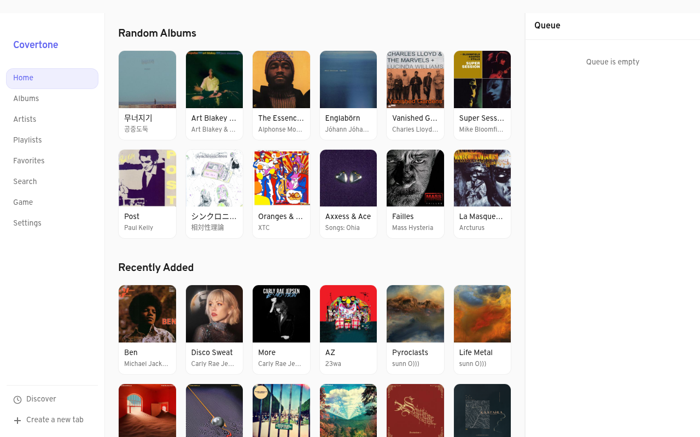
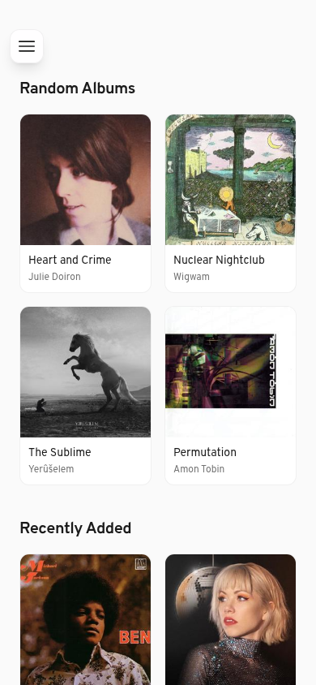
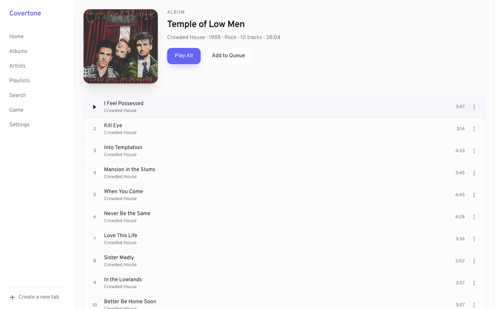
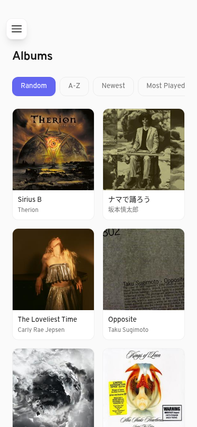

# Covertone

[](http://apps.obtainium.imranr.dev/redirect.html?r=obtainium://add/https://github.com/dbeley/covertone)

A modern Subsonic/Navidrome music streaming client for Web / Android / iOS tailored to my needs.

**Covertone is focused on music discovery with features that can't be found in any other Subsonic client out there (see [Features](#features)).**

<p align="center">
  
  
  
  
</p>

## Features

- **Tabbed browsing** - Switch between up to 10 tabs, each allowing you to navigate to a different part of the library
- **Auto DJ** - When the queue ends, automatically fetches similar songs
- **Guess the Artist** - Trivia game that plays a song and challenges you to pick the right artist
- **Random album discovery** - The default sorting view for albums is random to help you discover music
- **Cross-platform** - Installable PWA, Android app (via Capacitor), iOS app (via Capacitor), or Docker image

## Quick start

```bash
# Enter the dev shell (Nix)
direnv allow     # or: nix develop

# Install dependencies
pnpm install

# Start dev server
pnpm dev          # → http://localhost:5173
```

Configure your Subsonic/Navidrome server URL, username, and password in **Settings**.

## Scripts

| Script | Description |
|---|---|
| `pnpm dev` | Vite dev server |
| `pnpm build` | Production build → `dist/` |
| `pnpm preview` | Preview production build locally |
| `pnpm test` | Run all tests |
| `pnpm lint` | ESLint + Prettier + svelte-check |
| `pnpm format` | Auto-format all source files |
| `pnpm typecheck` | Svelte type checking |

## Platform Builds

### Web (PWA)

```bash
pnpm build       # output in dist/
pnpm preview     # preview at localhost:4173
```

The PWA uses `vite-plugin-pwa` with auto-updating service worker. Installable as a standalone app.

### Docker

```bash
pnpm docker:build   # build image tagged covertone:latest
pnpm docker:run     # serve at http://localhost:8080
```

### Android

**Prerequisites:** Nix flake provides everything (JDK 21 + Android SDK 35).

```bash
nix develop      # or: direnv allow
pnpm android:build     # debug APK
pnpm android:release   # signed release APK
pnpm android:bundle    # AAB for Google Play
```

Without Nix, export `ANDROID_HOME` pointing to the Android SDK.

Release signing is controlled via environment variables:

| Variable | Description |
|---|---|
| `ANDROID_KEYSTORE_PATH` | Path to keystore file |
| `ANDROID_KEYSTORE_PASSWORD` | Keystore password |
| `ANDROID_KEY_ALIAS` | Key alias (default: `covertone`) |
| `ANDROID_KEY_PASSWORD` | Key password |

Without these, Gradle builds an unsigned release APK.

On NixOS, `aapt2` is patched automatically via `scripts/patch-aapt2.sh`.

### iOS

```bash
# Requires macOS with Xcode
pnpm ios:add      # initialize iOS project
pnpm ios:sync     # sync web assets
pnpm ios:open     # open in Xcode
pnpm ios:build    # command-line build
```

## Tech Stack

| Layer | Technology |
|---|---|
| Framework | Svelte 5 + TypeScript |
| Build | Vite 6 |
| Styling | Tailwind CSS 4 |
| Mobile | Capacitor 8 (Android + iOS) |
| PWA | vite-plugin-pwa (Workbox) |
| Testing | Vitest + Testing Library |
| Linting | ESLint 9 + Prettier + svelte-check |
| Dev env | Nix flake |
